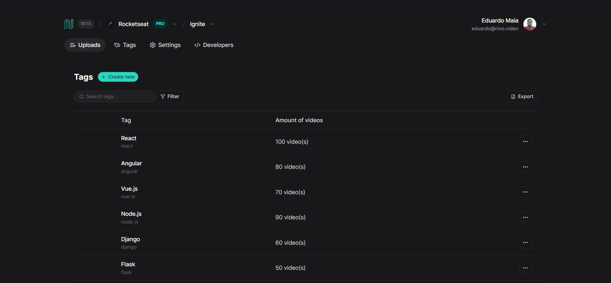

# Nivo - React na Prática
This application was developed during a Rocketseat event called **"React na prática"**.

## Technologies
- React.js
- TypeScript
- Vite
- Tailwindcss
- React Query
- React Hook Form

## Executing
After cloning the repository, access the project folder and execute the commands below:

```sh
  npm install
  npm run dev
```
Visit http://localhost:5173 to view the application.
